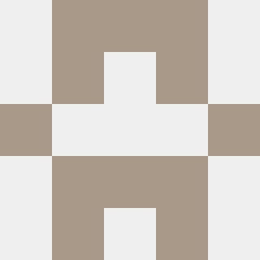

# Identicon

Following application generates GitHub-style identicons (avatars generated from some kind of id) into PPM image format.
Resulting images are based on 5x5 grids and are always symetric in the x axis. Shape of the identicon is encoded using
16-bit binary number, as there are 2^15 possible configurations (because there are 3 * 5 unique blocks, due to symetry constraint),
so that following bits of that number (read from the least significant one) encode if 
grid cells (sequenced in row major order) should be colored as on or off.

User may change image and grid size by modifing defines in `pattern.h` file.

## Example result:

(Pattern code 42771)


## Usage

```console
$ make
$ ./app <pattern_code>
$ <image_viewer_of_your_choice> result.ppm
```